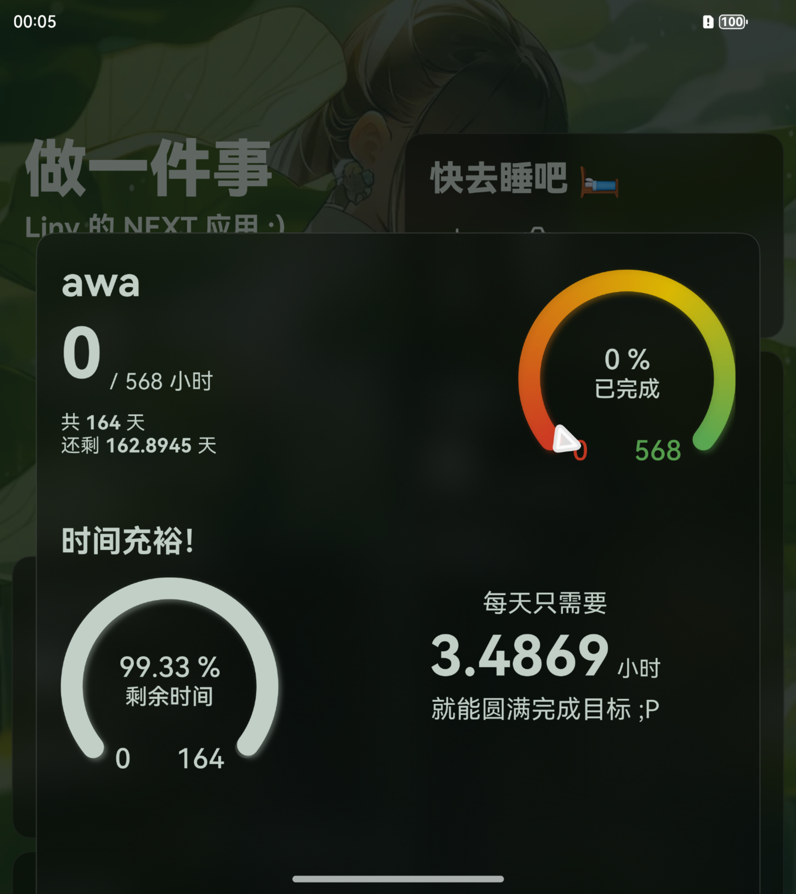
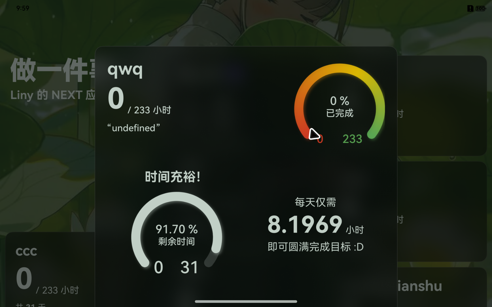

基于 HarmonyOS NEXT API12 构建！

# 这是什么？
《做一件事》是一个专注于记录和计划的 APP，可以创建计划卡片，设定完成期限、目标达成时长（以后可能还会添加各种其他项目的记录）

然后不定期打卡

这个软件会整理你的数据（还没做出来）然后呈现为数据看板的形式（赞美 ArkUI！）

# 刚刚开始
这个项目在 HDC 召开不久后才启动

这几天像是打极客松一样（争取把基础框架做出来

# 功能和实现
1. 自定义美化（Ｉ）
2. 添加卡片（Ｉ）
3. 删除卡片（Ｉ）
4. 编辑卡片（Ｉ）
5. 数据看板（Ｉ）

# 截图案例

